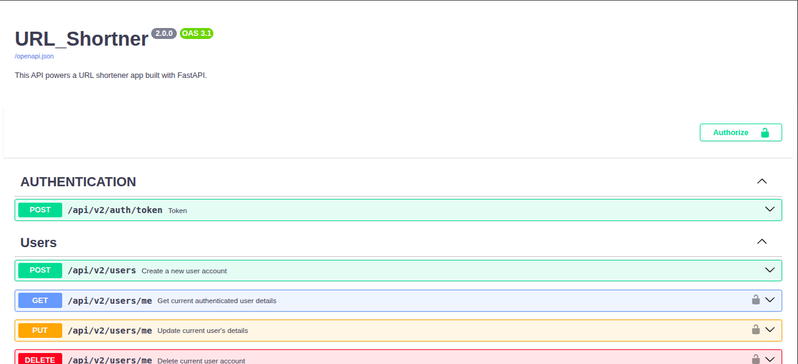
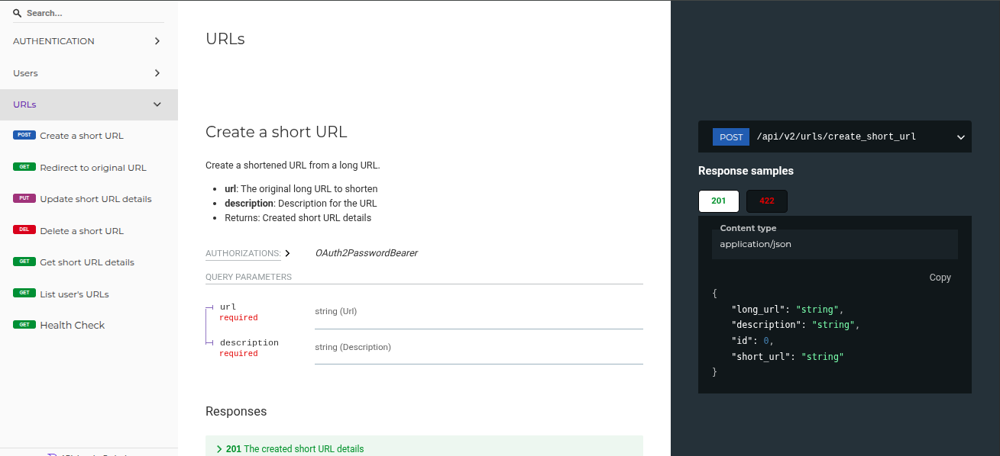

# URL Shortener

[](https://www.python.org/)
[](https://fastapi.tiangolo.com/)
[](https://modelcontextprotocol.io/)
[](https://prometheus.io/)
[](https://www.mysql.com/)
[](https://www.docker.com/)
[](https://kubernetes.io/)
[](https://opensource.org/licenses/MIT)

## 📝 Project Description

This is a modern, production-grade **URL Shortener** application designed to shorten URLs and manage links with comprehensive authentication, observability, and AI agent integration.

Built with **FastAPI** and **SQLAlchemy** (async/sync support), the application is database-agnostic—seamlessly supporting **MySQL** for production and **SQLite** for lightweight testing. It features token-based **JWT Authentication**, automated **Model Context Protocol (MCP)** tool discovery for LLMs and AI agents, **Prometheus metrics** instrumentation, and structured request correlation logging.

---

## ✨ Key Features

- **🔗 Core URL Management:** Create short URLs, customize descriptions, update destination URLs, redirect seamlessly, and inspect detailed metadata.
- **🤖 Model Context Protocol (MCP) Server:** Native built-in MCP server mounted at `/mcp` over HTTP transport. AI assistants (like Claude Desktop or custom agents) can directly interact with all API endpoints as strongly-typed MCP tools.
- **🔐 JWT Authentication & Authorization:** Secure user registration, login, and protected endpoints requiring Bearer tokens.
- **📊 Observability & Metrics:** Exposes real-time Prometheus metrics at `/metrics` and includes structured request logging with correlation IDs.
- **🧪 Comprehensive Test Suite:** 85+ unit, integration, and E2E tests written in Pytest covering API routers, database dependencies, authentication flows, and MCP tool registration.

---

## 📸 Screenshots

1. **Swagger Docs**
   
2. **ReDoc**
   

---

## 🤖 Model Context Protocol (MCP) Server

The application natively runs an **MCP Server** accessible via Streamable HTTP transport at `/mcp`. Every API endpoint is exposed with clean, action-oriented tool names and rich documentation tailored for LLMs.

### Available MCP Tools

| Tool Name | Operation ID | Description | Requires Auth |
| :--- | :--- | :--- | :--- |
| `login_for_token` | `login_for_token` | Authenticate with username & password to receive a JWT access token | No |
| `create_user` | `create_user` | Register a new user account | No |
| `get_current_user` | `get_current_user` | Retrieve profile details for the authenticated user | Yes |
| `update_current_user` | `update_current_user` | Update authenticated user profile details | Yes |
| `delete_current_user` | `delete_current_user` | Permanently delete the authenticated user account | Yes |
| `create_short_url` | `create_short_url` | Create a new short URL from a long URL | Yes |
| `redirect_short_url` | `redirect_short_url` | Redirect to the original destination long URL | No |
| `get_short_url_details` | `get_short_url_details` | Inspect metadata for a short URL without redirecting | No |
| `list_user_urls` | `list_user_urls` | List paginated short URLs owned by the authenticated user | Yes |
| `update_short_url` | `update_short_url` | Update destination URL or description for a short URL | Yes |
| `delete_short_url` | `delete_short_url` | Permanently delete a short URL | Yes |
| `health_check` | `health_check` | Check API server health status and version | No |

### Connecting an MCP Client

To connect an MCP-compatible assistant (such as Claude Desktop or an AI agent framework) to your locally running server, use the following server configuration:

```json
{
  "mcpServers": {
    "url-shortener": {
      "url": "http://localhost:8000/mcp"
    }
  }
}
```

#### MCP Authentication Workflow for LLMs
1. The assistant calls `login_for_token(username, password)` to obtain an `access_token`.
2. For protected tools (`create_short_url`, `list_user_urls`, etc.), the assistant passes the token in the request header: `Authorization: Bearer <access_token>`.

---

## ⚙️ Installation Guide

You can set up and run this application using various methods:

### a. Direct Installation on Your System

1. **Prerequisites:** Ensure you have Python 3.8+ installed on your system.
2. **Clone the Repository:**
   ```bash
   git clone https://github.com/SkeyRahaman/URL_Shortner
   cd URL_Shortner
   ```
3. **Install Dependencies:**
   ```bash
   pip install -r requirements.txt
   ```
4. **Environment Variables:** Create a `.env` file in the root directory of the project and add the following environment variables:

   ```dotenv
   URL_PREFIX=/api/v2

   # Database Configuration (for MySQL)
   MYSQL_ROOT_PASSWORD=secret_root
   DATABASE_PROTOCOL=mysql+pymysql
   DATABASE_USER=admin
   DATABASE_PASSWORD=secret
   DATABASE_HOSTNAME=database
   DATABASE_PORT=3306
   DATABASE_NAME=url_shortner

   # For SQLite testing (uncomment below and comment out MySQL settings above)
   # DATABASE_PROTOCOL=sqlite:///./sql_app.db
   ```
5. **Run the Application:**
   ```bash
   uvicorn app.main:app --host 0.0.0.0 --port 8000 --reload
   ```
   - **API Server & Swagger UI:** `http://localhost:8000/docs`
   - **MCP Streamable HTTP Endpoint:** `http://localhost:8000/mcp`
   - **Prometheus Metrics:** `http://localhost:8000/metrics`

### b. Docker Compose

1. **Prerequisites:** Ensure Docker and Docker Compose are installed.
2. **Edit Environment File:** Copy `sample.env` to `.env` and adjust settings as needed.
3. **Spin Up Services:**
   ```bash
   docker-compose up --build -d
   ```

### c. Kubernetes Deployment

1. **Prerequisites:** Ensure you have `kubectl` installed and a Kubernetes cluster configured.
2. **Apply Kubernetes Manifests:**
   ```bash
   cd Kubernetes
   kubectl apply -f ./
   ```

---

## 🚀 Tech Stack

- **Backend Framework:** FastAPI, Pydantic v2
- **AI / Model Context Protocol:** `fastapi-mcp` (Streamable HTTP Transport at `/mcp`)
- **Database & ORM:** SQLAlchemy (MySQL / SQLite)
- **Authentication:** JWT (JSON Web Tokens), Passlib / bcrypt
- **Observability:** Prometheus FastAPI Instrumentator (`/metrics`), Structured Request Correlation Logging
- **Testing:** Pytest, pytest-asyncio, HTTPX ASGI Transport
- **DevOps:** Docker, Docker Compose, Kubernetes

---

## ✅ Tests

Run the full automated test suite (85+ tests covering unit, integration, E2E, and MCP endpoints):

```bash
pip install -r requirements.txt
pytest -v
```

---

## 📚 API Endpoints

| Method | Endpoint | Description | Auth Required |
| :--- | :--- | :--- | :---: |
| `POST` | `/api/v2/auth/token` | Authenticate and get JWT access token | No |
| `POST` | `/api/v2/users` | Register a new user account | No |
| `GET` | `/api/v2/users/me` | Get current authenticated user details | Yes |
| `PUT` | `/api/v2/users/me` | Update current user details | Yes |
| `DELETE` | `/api/v2/users/me` | Delete current user account | Yes |
| `POST` | `/api/v2/urls/create_short_url` | Create a short URL | Yes |
| `GET` | `/api/v2/urls/{short_url}` | Redirect to original long URL | No |
| `GET` | `/api/v2/urls/{short_url}/details` | Get short URL metadata | No |
| `GET` | `/api/v2/urls` | List paginated short URLs belonging to user | Yes |
| `PUT` | `/api/v2/urls/{short_url}` | Update short URL destination or description | Yes |
| `DELETE` | `/api/v2/urls/{short_url}` | Delete short URL | Yes |
| `GET` | `/api/v2/health` | Check API server health status | No |
| `GET` | `/metrics` | Prometheus metrics exporter | No |
| `POST/GET` | `/mcp` | Model Context Protocol (MCP) HTTP endpoint | No |

---

## 🤝 Contributing Guidelines

1. **Fork** the repository.
2. **Create a feature branch:** `git checkout -b feature/your-feature-name`.
3. **Commit your changes** with clear messages.
4. **Run tests** to verify zero regressions (`pytest`).
5. **Open a Pull Request** to the `main` branch.

---

## 📞 Contact / Support

- **GitHub Profile:** [SkeyRahaman](https://github.com/SkeyRahaman/URL_Shortner)
- **Email:** [sakibmondal7@gmail.com](mailto:sakibmondal7@gmail.com)
- **Issues:** [GitHub Issues Page](https://github.com/SkeyRahaman/URL_Shortner/issues)